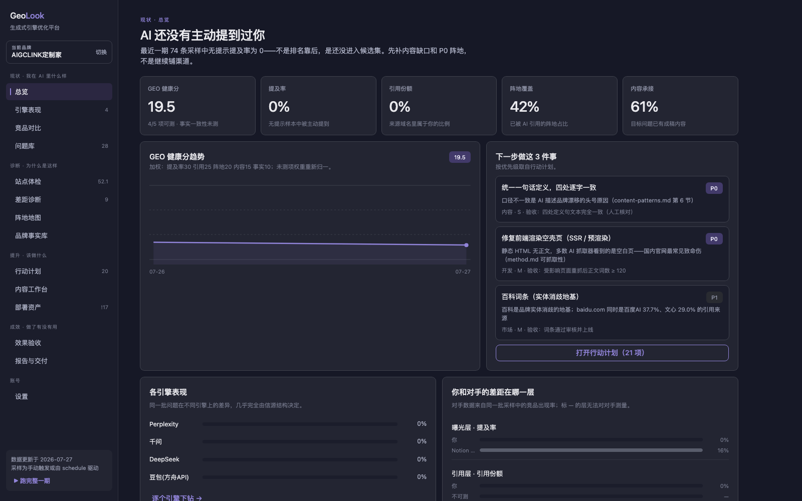
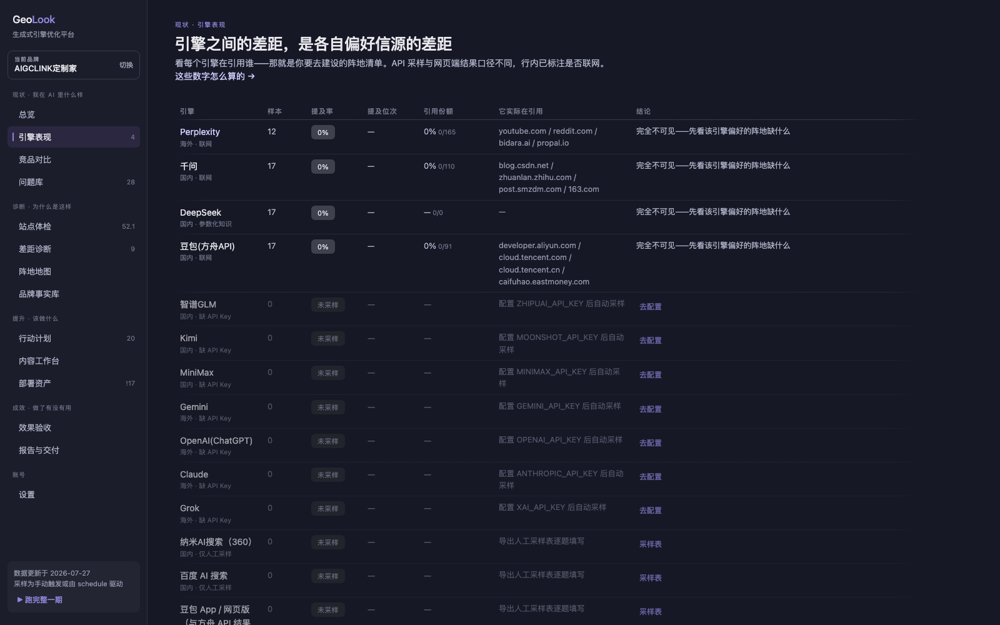
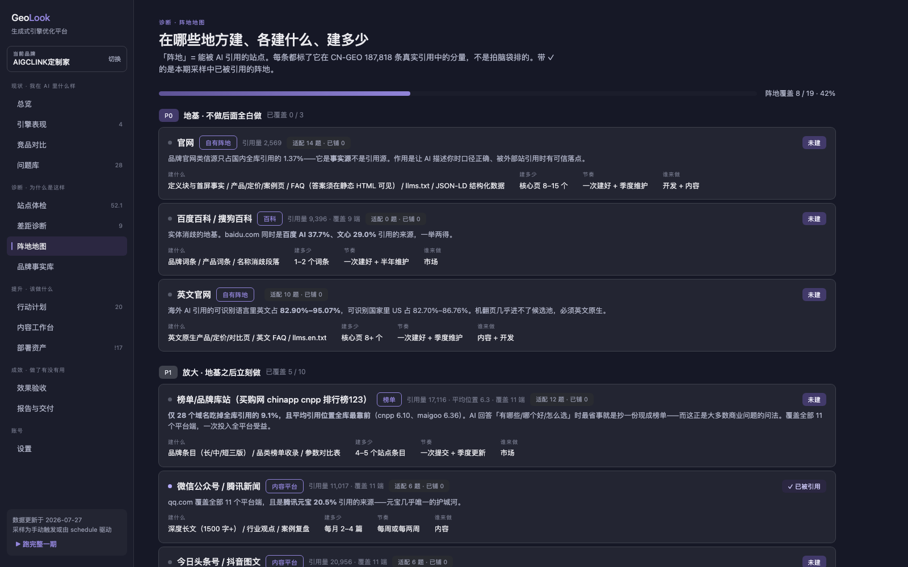
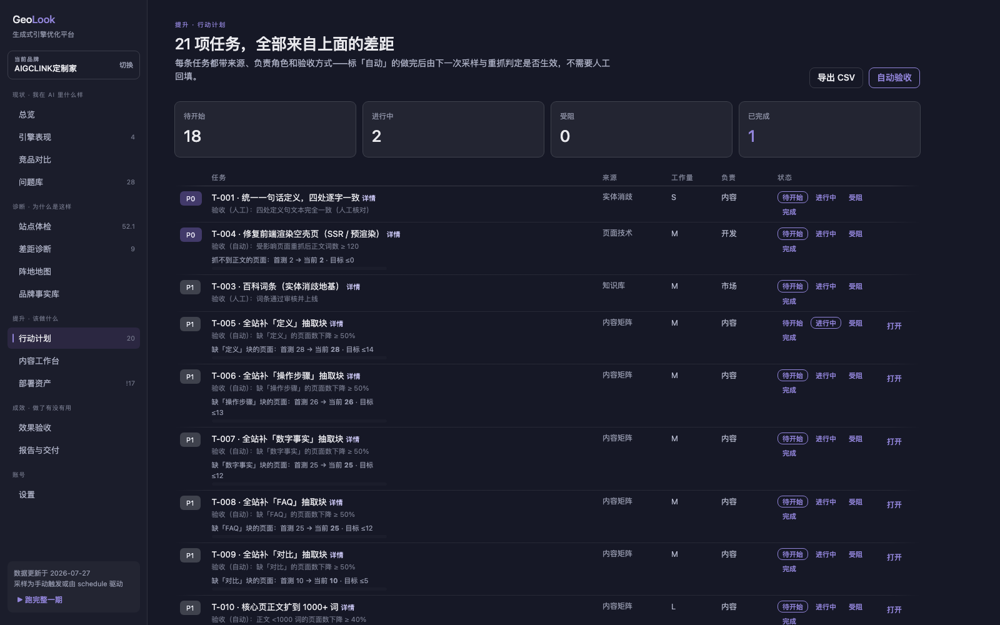

<div align="center">

# Geo**Look**

**Open-source, self-hosted platform for end-to-end GEO implementation**

For a specific project: status analysis → diagnosis → strategy → implementation tickets → execution → verification

[简体中文](README.md) · English

  

</div>

> GEO = Generative Engine Optimization — getting AI engines (ChatGPT, Perplexity, Gemini, DeepSeek, Doubao…) to **proactively mention and cite your brand** when answering user questions. Not geographic info, not classic SEO.



## What it does

GeoLook is not yet another GEO monitoring dashboard — it delivers **end-to-end GEO implementation for a specific project**: starting from status analysis and diagnosis, producing an actionable strategy and implementation tickets, following through to execution with automatic verification, and packaging the results for delivery. Point it at a product website and it answers four questions:

| Stage | Question | Pages |
|---|---|---|
| **Status** | How do AI engines see you today | Overview / Engines / Competitors / Question bank |
| **Diagnosis** | Why | Site audit / Gap diagnosis / Channel map / Brand facts |
| **Action** | What to do | Action plan / Content workbench / Deploy assets |
| **Results** | Did it work | Verification / Reports & delivery |

One command runs the whole pipeline:

```bash
python3 scripts/geo.py new --url https://example.com --market both
```

Nine automated steps: crawl the site → 6-dimension audit → derive brand facts / competitors / question bank from page copy → sample AI answers engine by engine → generate tickets with acceptance criteria → produce deployable assets (llms.txt / JSON-LD / definition blocks / FAQ / content drafts) → report → auto-verify → client delivery package.

## Highlights

### Dual-market engine observation

CN and Global markets get separate question banks, separate sampling, separate metrics — Chinese questions never hit Perplexity, English ones never hit Doubao.

| Market | Automated via API | Manual sampling sheet |
|---|---|---|
| CN | Zhipu GLM · Doubao (Ark) · DeepSeek · Kimi · MiniMax | Nano AI Search · Baidu AI · Doubao App |
| Global | Gemini · OpenAI (ChatGPT) · Claude · Grok · Perplexity | ChatGPT web · Claude web |



### Reproducible metrics

- **Mention rate**: share of unprompted samples where the AI brings your brand up on its own (brand-named questions are excluded — they'd be 100% false positives)
- **Citation share** of your domains; **brand mention distribution** — you vs. competitors inside answers
- **Per-question diagnosis**: suspected-negative > competitor-dominated > absent > low-ranked, fixed rules
- **GEO health score**: mention×30 + citation×25 + channels×20 + content×15 + facts×10; unmeasured items are re-normalized, never faked
- Every number links to a "where do these numbers come from" methodology panel, kept in sync with the code

### Channel map: where to build, what, how much

19 channels weighted by real citation-corpus data (citation volume / average position / platform coverage), tiered P0/P1/P2. Each channel declares which content categories it carries, two-way linked with the workbench — finish a piece, the distribution checklist shows where it should go; check it off, and the next sampling round verifies whether the channel actually gets cited.



### Auto-verified tickets with before/after

Every ticket carries acceptance criteria. "Auto" tickets are judged by re-crawling and the next sampling round — done means measured, not claimed. Quantified tickets show a "first-measured → current → target" progress bar; regressions reopen automatically.



### Content workbench: topic to distribution

Topic pool sorted by "not mentioned + no content". While writing you get required extraction blocks (numbers +61.6%, definitions +57.3% measured citation-probability lift) and brand facts on the left, a citability pre-check on the right. Finished pieces publish to GitHub / WordPress drafts / WeChat OA drafts / custom webhook — always with a manual confirmation.


### And more

- **Site audit**: robots / sitemap / llms.txt / extraction blocks, with click-through filtering and direct links to the fixing ticket
- **Competitors**: each rival's strongest engine, one click away; lost/exclusive questions feed the topic pool
- **Brand facts**: the single source of truth — llms.txt and JSON-LD are generated from it; AI claims are compared entry by entry
- **Verification**: per-question before/after across sampling rounds (per market), task-level before/after
- **Scheduled re-runs**: full cycle every 7/14/30 days for long-term operations and monthly reports
- **Multi-brand**: one instance, many isolated projects

## Quick start

```bash
git clone https://github.com/bingqiang2021/geolook.git
cd geolook
pip3 install requests beautifulsoup4 lxml   # the only third-party deps

# Open the dashboard (engine keys can be configured in Settings, stored in local .env)
python3 scripts/geo.py ui                   # → http://127.0.0.1:8765

# Or fully automated
python3 scripts/geo.py new --url https://example.com --market both
```

Works with zero API keys too — automated sampling is skipped and engines without APIs use manual sampling sheets (`sample-sheet` export, `sample-import` ingest).

## Commands

| Command | What it does |
|---|---|
| `new` | ★ One URL in, three deliverables out, fully automated |
| `ui` | ★ Full-workflow dashboard |
| `serve` / `cycle` | Full pipeline / light loop (crawl→audit→sample→report) |
| `bootstrap` | Derive brand facts, competitors, question bank from site copy |
| `crawl` / `audit` | Crawl / 6-dimension GEO scoring |
| `sample` (+`sample-sheet`/`sample-import`) | API sampling / manual sheets |
| `plan` | Diagnosis → structured tickets with acceptance criteria |
| `generate` | Deployable assets (`--draft` adds LLM first drafts) |
| `lint` | Fabrication-risk check for AI drafts — mandatory before shipping |
| `verify` | Re-crawl and auto-verify tickets |
| `report` / `deliverables` / `deliver` | Reports / formal deliverables / client package |
| `publish` | Push finished content to configured channels (always manual) |

## Evidence-based scoring

All six audit dimensions are anchored in public empirical data (602 prompts / 21,143 citations / 187,818 deduplicated CN citations); `scripts/audit.py` implements [references/method.md](references/method.md). A few of the most useful findings:

- High-impact pages average **1,943 words**; low scorers just 170 (11.4×)
- Numbers **+61.6%**, definitions **+57.3%**, comparisons **+55.3%**, how-to **+41.2%** citation-probability lift
- Pure Q&A formatting is **−5.7%** — looking like an FAQ doesn't help
- Topical relevance is the strongest predictor (r = 0.432), above authority
- Brand-owned sites get only **1.37%** of CN citations — your site is the fact source, external channels are the citation sources

## Design principles

- **Single-machine, self-hosted**: stdlib `http.server` bound to 127.0.0.1 only; no database, no accounts — data is plain JSON/Markdown under `work/<project>/`, `git init` is your backup
- **Never fabricate**: brand facts come only from site copy (unknowns marked "unconfirmed"); inventing competitor names is forbidden; AI drafts must pass a risk lint and human review before publishing
- **Verification is the product**: if something can be auto-verified, it never relies on someone saying "done"
- **Publishing is always manual**: channel credentials live in local `.env` (mode 600); every publish requires an explicit click; WeChat/WordPress go to drafts only — there is no automated outbound path

## Claude Code integration

This repo doubles as a Claude Code skill ([SKILL.md](SKILL.md)): drop it into your skills directory and tell Claude "do GEO for example.com" to drive the whole pipeline, including the LLM-judgment steps (question bank design, content drafts, report narration). Claude is optional — every script is a plain CLI.

## Layout

```
scripts/          All logic (geo.py CLI · dashboard.py server · ui.html single-page UI)
references/       Methodology: sampling discipline, content patterns, citation structures
tests/            Unit tests
work/<slug>/      Per-project data (gitignored, never leaves your machine)
docs/screenshots/ UI screenshots · docs/demo.mp4 40-second product demo
```

## Demo

📹 [40-second demo video](docs/demo.mp4) · 🖼 [All screenshots](docs/screenshots/)

## License

[MIT](LICENSE)
